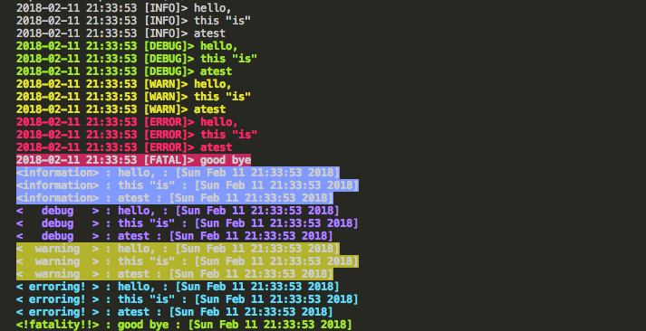

# log

Package log provides a thread safe multi-tiered logger used to log output to a io.Writer.
The different tiers are (least to highest piority):

1. Info
2. Debug
3. Warn
4. Error
5. Fatal

One can set the output, output format, and output time format. One can also set the tags, and colors for tags for each tier.

Convenience functions are given to print a line or formated line to log for each tier.

Example

``` golang

package examples

import (
	"os"

	"github.com/popmedic/go-logger/log"
	"github.com/popmedic/go-logger/log/colors/tty"
)

// Run1 runs the first example
func Run1() {
	// Show the defaults...
	log.Info("hello,")
	log.Infof("this %q", "is")
	log.Info("a", "test")
	log.Debug("hello,")
	log.Debugf("this %q", "is")
	log.Debug("a", "test")
	log.Warn("hello,")
	log.Warnf("this %q", "is")
	log.Warn("a", "test")
	log.Error("hello,")
	log.Errorf("this %q", "is")
	log.Error("a", "test")
	log.Fatal(func(int) {}, "good bye")
	// Change it up...
	log.GetDebug().SetColor(log.NewColor(tty.FgMagenta.String(), tty.Reset.String()))
	log.GetInfo().SetColor(log.NewColor(tty.BgHiBlue.String(), tty.Reset.String()))
	log.GetWarn().SetColor(log.NewColor(tty.BgYellow.String(), tty.Reset.String()))
	log.GetError().SetColor(log.NewColor(tty.FgCyan.String(), tty.Reset.String()))
	log.GetFatal().SetColor(log.NewColor(tty.FgHiGreen.String(), tty.Reset.String()))
	log.GetInfo().SetTag(log.NewTag("information"))
	log.GetDebug().SetTag(log.NewTag("   debug   "))
	log.GetWarn().SetTag(log.NewTag("  warning  "))
	log.GetError().SetTag(log.NewTag(" erroring! "))
	log.GetFatal().SetTag(log.NewTag("!fatality!!"))

	log.SetFormat("<{TAG}> : {MSG} : [{TIME}]")
	log.SetTimeFormat("Mon Jan _2 15:04:05 2006")

	log.Info("hello,")
	log.Infof("this %q", "is")
	log.Info("a", "test")
	log.Debug("hello,")
	log.Debugf("this %q", "is")
	log.Debug("a", "test")
	log.Warn("hello,")
	log.Warnf("this %q", "is")
	log.Warn("a", "test")
	log.Error("hello,")
	log.Errorf("this %q", "is")
	log.Error("a", "test")
	log.Fatal(os.Exit, "good bye")
}

```
### **Output**

